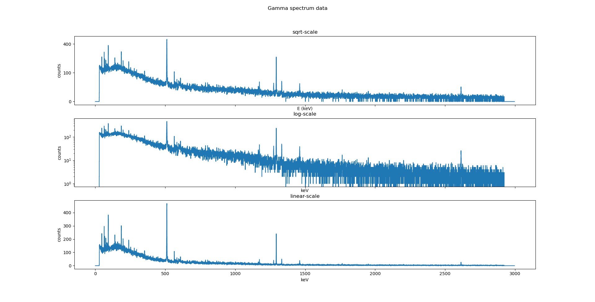

# PeakFinding
This module incorporates the tools needed to
- visualize a spectrum;
- convert between different formats of storing gamma spectra, while preserving metadata;
- find peaks on a spectrum.

## Usage: Installation-free!
These codes aren't packaged into a module yet. You can:
1. `git clone git@github.com:OceanNuclear/PeakFinding.git`
2. `cd PeakFinding`
3. \[optional\]`rm -r literature/ maths_exploration/ # remove the files that won't be used by most people`
And then to demonstrate the functionality,

## Spectrum visualization, in sqrt scale
One of the primary aims of visualizing your data is to identify where the peaks are, and to differentiate them from the background noise.
I argue the use of a sqrt-count as the y-axis is more useful than log-count as the y-axis or (linear-)count as y-axis.

### The Poisson distribution justification
**The count in each bin should follow a Poisson distribution.** And if neighbouring bins follows similar poisson distribution, the amount of noisy jitter (which shows up on the spectrum as, what I call a fuzz-band) in the background will be proportional to √(counts).

Therefore plotting sqrt-count as the y value will give us a histogram with fuzz-band of **constant** width.

This is the *mathematically* optimal way of presenting your data. Peaks will show up in your spectrum more easily as you don't have to mentally adjust for the expectation a widening fuzz-band at the high-energy end of the spectrum, where the average count rate is low.


As you can see, the log-scale presentation gives very high resolution at the low count rate (high energy) end of the spectrum, but at the same time it becomes increasingly difficult to tell signal from noise.

As for the linear-scale presentation, most of the low-count peaks are so weak that they aren't even visible to the naked eye.

Meanwhile, you can see each peak cleanly and distinctly in the sqrt-scale presentation, without confusing it with noise, so that you can confidently declare the presence or absence of peak anywhere on the spectrum.



Notice the constant-width fuzz-band in the sqrt-scale presentation, as previously mentioned. No other presentation can achieve the same constant-width fuzz-band look.

## Convert between different gamma-spectra formats (metadata preserved)
`mv user_script/merge_Spe.py . ; python merge_Spe.py example_file/*.Spe temp_test_spec.Spe`

## Find peaks on a spectrum
`python decision_explanation.py example_file/*.Spe`

A peak detection-algorithm was derived based on the Poisson-ian nature of the particle spectrum. To increase the specificity of its result, a simple 2nd order fit algorithm was used to reject peaks with absolute 2nd order derivative lower than a threshold.


## Adding together multiple spectra
The `__add__` operator for the RealSpectrum has been overloaded to allow adding of spectra.
```python
from peakfinding.spectrum import RealSpectrum
spec1 = RealSpectrum.from_Spe("Cu_01.Spe")
spec2 = RealSpectrum.from_Spe("Cu_02.Spe")
spec3 = RealSpectrum.from_Spe("Cu_03.Spe")
summed_spec = spec0 + spec1 + spec2
```
Let's say you have three spectra: `Cu_01.Spe` (acquired from 11:00-11:05), `Cu_02.Spe` (acquired from 11:05-11:10), `Cu_03.Spe`(acquired from 11:10-11:15).
In this situation, it's natural to want to know the summed spectrum as if you had a single spectrum spanning 11:00 - 11:15.

To do this, you can use the following snippet:
```python
summed_spec = RealSpectrum.from_multiple_files("Cu_01.Spe", "Cu_02.Spe", "Cu_03.Spe")
```

If you're familiar with unix command line interfaces, you generate a new file using
```bash
python user_scripts/merge_spe.Spe Cu_0*.Spe output.Spe
```

## Advanced usage
For reference, commit c726c8b1bb98da1dfcd957f802920b4b1d9d9fb8 was so good that it could identify even the weak coincidence peaks, (I think it out-performed the mathematically possible limit, at the cost of giving too many false positives). However, it also underperformed in terms of background level estimation; and I don't want my spectrum cluttered up with coincidence peaks. So I upgraded it to the current (commit 523ad9297f91d554baee62fef7cfc5ff414ce625) mathematically more rigorous version.
